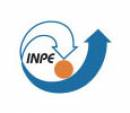
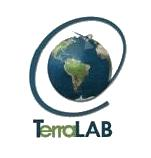
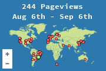

# TerraME: Multiparadigm Modeling Toolkit

---


TerraME is a programming environment for spatial dynamical modelling. It supports cellular automata, agent-based models, and network models running in 2D cell spaces. TerraME provides an interface to TerraLib geographical database, allowing models direct access to geospatial data. Its modelling language has in-built functions that makes it easier to develop multi-scale and multi-paradigm models for environmental applications.

Two important innovations in TerraME are its use of anisotropic spaces and of hybrid automata models. Anisotropic spaces arise when modeling natural and human-related phenomena. For example, land settlers in a new area do not occupy all places at the same time. They follow roads and rivers, leading to an anisotropic pattern. Anisotropic spaces are implemented in TerraME using Generalized Proximity Matrices (GPM). The GPM is an extension of the usual definition of the spatial relations and include a combination of neighborhood measures in the absolute space and in the relative space.

A hybrid automaton is an abstract model for a system whose behavior has discrete and continuous parts. It extends the idea of finite automata to allow continuous change to take place between transitions. Adopting hybrid automata in spatial dynamical models allows complex models which include critical transitions.

A vision of research motivations and directions of Environmental Modelling in INPE is available [in this presentation](http://www.terrame.org/lib/exe/fetch.php?tok=d5e0fa&media=http%3A%2F%2Fwww.dpi.inpe.br%2Fgilberto%2Fpresent%2Fvision.ppt). An early presentation of our vision is [How can GIScience contribute to Land Change Modelling?](http://www.terrame.org/lib/exe/fetch.php?tok=28b647&media=http%3A%2F%2Fwww.dpi.inpe.br%2Fgilberto%2Fpresent%2Fcamara_giscience2006_keynote.ppt), the keynote speech at GIScience 2006. The rationale for the TerraME software is presented in the lecture [Modelling human-environment interactions](http://www.terrame.org/lib/exe/fetch.php?tok=a137e6&media=http%3A%2F%2Fwww.dpi.inpe.br%2Fgilberto%2Fpresent%2Fmodelling_human_environment_interactions.ppt), presented in the Vespucci Summer School 2010.

## Download

---
The latest version of TerraME is 2.0.1 (Released on 20 August 2020). It has installers for Windows and Mac and there is a compiled version for Linux.

- [**Download TerraME 2.0.1**](https://github.com/TerraME/terrame/releases)

In Windows, you can run TerraME by clicking in the icon on Desktop. In Mac and Linux, it is possible to run it by calling

```{.bash}
$> terrame
```

using the command prompt. The graphical interface has options to run examples, configure and run models, see documentation, as well as download and install additional packages. There are links to the source code of the models as well as the examples in the documentation.

## Editor

---

You can implement models in TerraME using any text file editor of your preference, such as [Notepad++](http://notepad-plus-plus.org/), [Vim](http://www.vim.org/) or [Emacs](http://www.gnu.org/software/emacs/). We currently suggest that you use [ZeroBraneStudio](http://studio.zerobrane.com/) as your programming environment to develop models in TerraME. It is free and open source (but it is possible to donate to the project). After downloading and installing ZeroBraneStudio (ZBS), please execute the steps in the tutorial available [here](https://github.com/TerraME/terrame/wiki/ZB).


## Documentation
---

### Tutorials

- [Lua for TerraME: A Short Introduction](http://www.terrame.org/lib/exe/fetch.php?media=docs:luaforterrame-ashortintroduction2.pdf)
- [An Introduction to TerraME](https://github.com/TerraME/terrame/wiki/Introduction)
- [Modeling Paradigms in TerraME](https://github.com/TerraME/terrame/wiki/Paradigms)
- [Creating and Filling Cellular Spaces](https://github.com/TerraME/terrame/wiki/Fill)
- [Multiple Simulations](https://github.com/TerraME/terrame/wiki/Calibration)
- [Publishing Geospatial Data](https://github.com/TerraME/terrame/wiki/Publish)


### Packages

You can execute a Google search in TerraME packages [here](https://cse.google.com/cse/publicurl?cx=011124210546699273653:pomdzxscb3o). The two basic packages of TerraME that comes with its installation are:

- [**base**](http://www.terrame.org/packages/doc/base/doc/index.html): A package with the basic modelling concepts, such as Cell, CellularSpace, Agent, Timer, and Model.
- [**gis**](http://www.terrame.org/packages/doc/gis/doc/index.html): A package to handle geospatial data. It has types to manage TerraView projects as well as functions to create and fill cellular layers.

Using the graphical interface, it is possible to download and install packages from TerraME's repository. They are are:

- [**ca**](http://www.terrame.org/packages/doc/ca/doc/index.html): Some cellular automata models.
- [**logo**](http://www.terrame.org/packages/doc/logo/doc/index.html): Basic spatial agent-based models.
- [**sci**](http://www.terrame.org/packages/doc/sci/doc/index.html): A small package with interpolation functions.
- [**sysdyn**](http://www.terrame.org/packages/doc/sysdyn/doc/index.html): Examples using system dynamics models.
- [**calibration**](http://www.terrame.org/packages/doc/calibration/doc/index.html): Functions to run a given model several times, as well as metrics to compute goodness-of-fit and to calibrate models using genetic algorithms.
- [**publish**](http://www.terrame.org/packages/doc/publish/doc/index.html): Create webmap tools using the input as well as output of models.
- [**gpm**](http://www.terrame.org/packages/doc/gpm/doc/index.html): Create geospatial data as well as neighbourhood files using connectivity networks such as roads.

You can run examples directly in the graphical interface of TerraME. Click in the Desktop icon to open it in Windows or run “terrame” in the command line to open the graphical interface. From the graphical interface it is possible to see the documentation of each installed package.

### Courses

- We use TerraME on our courses on Enviromental Modelling. We give regular graduate courses in the research programs in Earth System Science at INPE and Computer Science at UFOP.

### FAQ

Frequently asked questions are answered [here](https://github.com/TerraME/terrame/wiki/FAQ).


## Papers and reports

---

- Bezerra et al. [New land-use change scenarios for Brazil: Refining global SSPs with a regional spatially-explicit allocation model](https://doi.org/10.1371/journal.pone.0256052). Plos one 17.4, 2022: e0256052.
- Aguiar et al. [Land use change emission scenarios: anticipating a forest transition process in the Brazilian Amazon](https://doi.org/10.1111/gcb.13134). Global change biology, v. 22, n. 5, p. 1821-1840, 2016.
- Aguiar et al. [Modeling the spatial and temporal heterogeneity of deforestation‐driven carbon emissions: the INPE‐EM framework applied to the Brazilian Amazon](https://doi.org/10.1111/j.1365-2486.2012.02782.x). Global Change Biology, v. 18, n. 11, p. 3346-3366, 2012.
- Carneiro, T. G. S. ; Andrade, P. R. ; Câmara, G. ; Monteiro, A. M. V. ; Pereira, R. R. . [An extensible toolbox for modeling nature-society interactions](http://www.sciencedirect.com/science/article/pii/S1364815213000534). *Environmental Modelling & Software*, 2013. DOI:10.1016/j.envsoft.2013.03.002.
- Silva, S. H. C. ; Carneiro, T. G. S. ; Lima, J.. TerraME HPA: Parallel Simulation of Multi-Agent Systems over SMP. *ACM SIGSIM Conference on Principles of Advanced Discrete Simulation*, 2013, Montreal.
- Rodrigues, A. J. C., Carneiro, T. G. S., Andrade, P. R.. [TerraME Observer: An extensible real-time visualization pipeline for dynamic spatial models](http://www.terralab.ufop.br/dokuwiki/lib/exe/fetch.php?media=terralab:publicacoes:observer-article-final.pdf). *XVIII Brazilian Symposium on Geoinformatics*, Campos do Jordão, 2012.
- Moreira, Costa, Aguiar, Camara, Carneiro. [Dynamical coupling of multiscale land change models](http://www.terrame.org/lib/exe/fetch.php?tok=a7b3a6&media=http%3A%2F%2Fwww.dpi.inpe.br%2Fgilberto%2Fpapers%2Fmoreira_landscape_ecology_2009.pdf),*Landscape Ecology*, 24(9), p. 1183-1194, 2009.
- Andrade, Monteiro, Câmara, Sandri. [Games on Cellular Spaces: How Mobility Affects Equilibrium](http://www.terrame.org/lib/exe/fetch.php?tok=8bdab2&media=http%3A%2F%2Fwww.dpi.inpe.br%2Fgilberto%2Fpapers%2Fandrade_mobility_jasss_2009.pdf).*Journal of Artificial Societies and Social Simulation (JASSS)*, 12(1), p. 4, 2009.
- Carneiro, Câmara, Maretto. [Irregular Cellular Spaces: Supporting Realistic Spatial Dynamic Modeling using Geographical Databases](http://www.terrame.org/lib/exe/fetch.php?tok=e74f1a&media=http%3A%2F%2Fwww.dpi.inpe.br%2Fgilberto%2Fpapers%2Firregular_cellular_space_geoinfo2008.pdf). *X Brazilian Symposium on Geoinformatics*, GeoInfo'08, Rio de Janeiro, 2008.
- Carneiro. [Nested-CA: a foundation for multiscale modeling of land use and land change.](http://www.terrame.org/lib/exe/fetch.php?tok=eeb8ff&media=http%3A%2F%2Fwww.dpi.inpe.br%2Fgilberto%2Fteses%2Fnested_ca.pdf) *PhD Thesis*, INPE, 2006.

## Extensions

---

- [LUCCME](http://luccme.ccst.inpe.br/), an extension for top-down land change modeling.
- [INPE-EM](http://inpe-em.ccst.inpe.br/conteudo_en/index.html), a framework to compute greenhouse gases emission estimates from land cover change


## Acknowledgements
---

### Supporting Software


The TerraME modelling language is an extension of the Lua programming language and interfaces to TerraLib GIS library for archival and retrieval of geospatial data. Many thanks to the Lua and TerraLib teams for providing such good environments to build upon!

[](http://www.lua.org) [](http://www.dpi.inpe.br/terralib5/wiki/doku.php)

### Funding

[](https://www.gov.br/cnpq/pt-br) [](http://www.fundoamazonia.gov.br/) 

## About

---

TerraME has been developed as a joint effort between INPE and TerraLab (Laboratory for Modelling and Simulation of Earth Systems), at Federal University of Ouro Preto.

[](http://www.inpe.br/)
[](http://www.terralab.ufop.br/)
[](http://www.ufop.br/)

The chief developers of TerraME are Pedro R. Andrade, from INPE, and [Tiago Garcia de Senna Carneiro](http://www.terralab.ufop.br/dokuwiki/doku.php?id=terralab:equipe:tiago:indice), from Federal University of Ouro Preto (UFOP). INPE's researchers involved in developing models using TerraME include [Dr. Gilberto Camara](http://www.dpi.inpe.br/gilberto), [Dr. Antonio Miguel Monteiro](http://www.dpi.inpe.br/~miguel), and[Dr. Ana Paula Aguiar](http://www.dpi.inpe.br/quem_somos/anapaula/).


Past contributors to TerraME include:

- Rodrigo Avancini
- Antônio Oliveira Jr.
- Heitor Guerra
- João Chagas
- Pedro Henrique Costa
- Raphael Costa
- [Rodrigo Reis Pereira](http://www.terralab.ufop.br/dokuwiki/doku.php?id=terralab:equipe:reisrodrigo:indice)
- [Antônio José da Cunha Rodrigues](http://www.terralab.ufop.br/dokuwiki/doku.php?id=terralab:equipe:antonio:indice)
- [Breno de Almeida Pereira](http://www.terralab.ufop.br/dokuwiki/doku.php?id=terralab:equipe:pereirabreno:indice)
- [Frederico Gadelha Guimarães](https://plus.google.com/109986130474370451035/about)
- [Henrique Cota Camello](http://www.terralab.ufop.br/dokuwiki/doku.php?id=terralab:equipe:camellohenrique:indice)
- [Rafael Lage Moreira Barbosa](http://www.terralab.ufop.br/dokuwiki/doku.php?id=terralab:equipe:lagerafael:indice)
- Raian Vargas Maretto
- [Rodolfo Ayala Lopes Costa](http://www.terralab.ufop.br/dokuwiki/doku.php?id=terralab:equipe:rodolfo:indice)
- [Rodolfo Maduro Almeida](http://sites.google.com/site/amazonida/)
- Sergio Souza Costa
- [Saulo Henrique Cabral Silva](http://www.terralab.ufop.br/dokuwiki/doku.php?id=terralab:equipe:henriquesaulo:indice)
- [Tiago Franca de Melo Lima](http://www.terralab.ufop.br/dokuwiki/doku.php?id=terralab:equipe:tiagolima:indice)
- [Washington Sena de França](http://www.terralab.ufop.br/dokuwiki/doku.php?id=terralab:equipe:francawashington:indice)


## Statistics

---

[](http://www3.clustrmaps.com/counter/maps.php?url=http://www.terrame.org)

